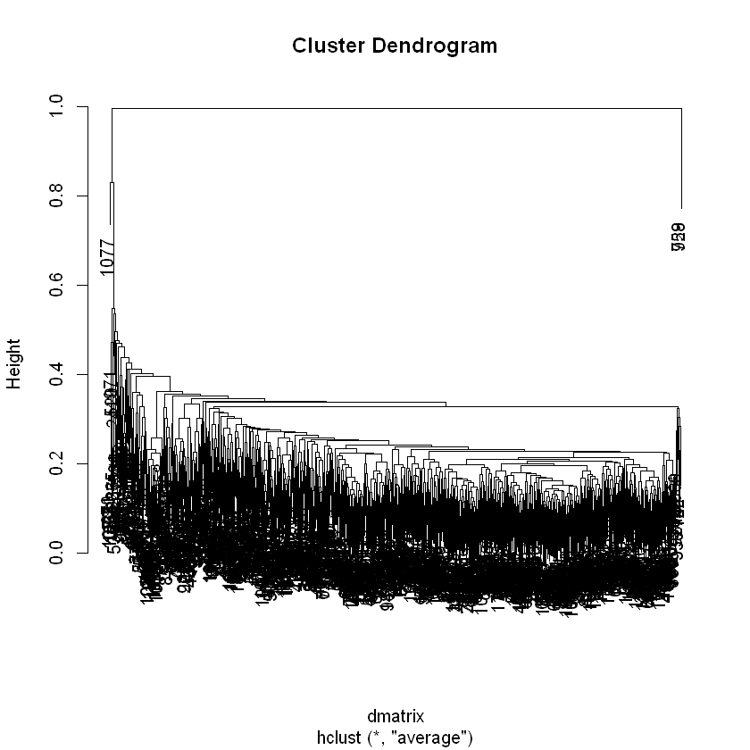

## Dynamic Time Warping with hiererchical clustering


## Create directories with date and versions


```R
## Create directories first
t=format(Sys.time(), "%d_%b_%Y")
dir.create(paste("C:/MinuteClinic/Dynamic_time_warping/modeling_work_",t,sep=""))
setwd(paste("C:/MinuteClinic/Dynamic_time_warping/modeling_work_",t,sep=""))
subDir=paste(getwd())
version_path=paste(subDir,"/version_name",sep="")
ifelse(file.exists(version_path),,dir.create(file.path(version_path)))
indata_path=paste(subDir,"/dtw_indata",sep="")
ifelse(file.exists(indata_path),,dir.create(file.path(indata_path)))

modelpath=version_path
outpath=paste(subDir,"/version_name/output",sep="")
ifelse(file.exists(outpath),,dir.create(file.path(outpath)))
#create figures folder
#figures=paste(subDir,"/version_name/figures",sep="")
#ifelse(file.exists(figures),,dir.create(file.path(figures)))

list.files()
setwd(modelpath)
list.files()
```


TRUE


TRUE


TRUE


<ol class=list-inline>
	<li>'dtw_indata'</li>
	<li>'version_name'</li>
</ol>


'output'


## Create a time series data set from hourly data
Starting with visit level data. Create an hourly aggregated data set for analysis.


```R
require(dplyr)
require(lubridate)
# Develop best version hourly data ------
options(warn=0)
visit_level=read.csv('C:/MinuteClinic/Data/MC_data_01JAN2016_to_02JUL2018.csv')
visit_level$Employee=ifelse(visit_level$VisitOrigin=='Employee',1,0)
visit_level$Hmpil=ifelse(visit_level$VisitOrigin=='Hmpil',1,0)
visit_level$Scheduled=ifelse(visit_level$VisitOrigin=='Scheduled',ifelse(visit_level$ScheduleVisitType=="PSS",1,0),0)
visit_level$WalkIn=ifelse(visit_level$VisitOrigin=='Walk-In',1,0)
visit_level$RevenueGenerating=ifelse(visit_level$VisitStatus=='Revenue Generating',1,0)
visit_level$CompleteNonGenerating=ifelse(visit_level$VisitStatus=='Complete Non Revenue',1,0)
visit_level$ReferOutNoCharge=ifelse(visit_level$VisitStatus=='Refer Out No Charge',1,0)
visit_level$Canceled=ifelse(visit_level$VisitStatus=='Canceled',1,0)
visit_level$year=substr(visit_level$AppointmentDate,1,4)
visit_level$day=substr(visit_level$AppointmentDate,5,6)
visit_level$week=week(ymd(visit_level$AppointmentDate))
visit_level$Wait.Time=ifelse(visit_level$Canceled==1,0.01,visit_level$Wait.Time)
#subset to after Q4 of 2017
visit_level=filter(visit_level, AppointmentDate>=20171001)
visit_level$Hour=visit_level$AppointmentTimeOfDay/10000
visit_level=filter(visit_level, Hour>8 & Hour<=20)
visit_level$Hour=round(visit_level$Hour)
head(visit_level)
```

    Loading required package: dplyr
    
    Attaching package: 'dplyr'
    
    The following objects are masked from 'package:stats':
    
        filter, lag
    
    The following objects are masked from 'package:base':
    
        intersect, setdiff, setequal, union
    
    Loading required package: lubridate
    
    Attaching package: 'lubridate'
    
    The following object is masked from 'package:base':
    
        date
    


<table>
<thead><tr><th scope=col>AppointmentDate</th><th scope=col>ClinicNumber</th><th scope=col>ProviderEpicid</th><th scope=col>VisitStatus</th><th scope=col>AppointmentTimeOfDay</th><th scope=col>AppointmentMadeTimeOfDay</th><th scope=col>Wait.Time</th><th scope=col>ScheduleVisitType</th><th scope=col>VisitOrigin</th><th scope=col>ScheduleTimeOfDay</th><th scope=col>...</th><th scope=col>Scheduled</th><th scope=col>WalkIn</th><th scope=col>RevenueGenerating</th><th scope=col>CompleteNonGenerating</th><th scope=col>ReferOutNoCharge</th><th scope=col>Canceled</th><th scope=col>year</th><th scope=col>day</th><th scope=col>week</th><th scope=col>Hour</th></tr></thead>
<tbody>
	<tr><td>20171001          </td><td>02497             </td><td>3323              </td><td>Revenue Generating</td><td>104000            </td><td>103714            </td><td> 0.033333         </td><td>                  </td><td>Walk-In           </td><td>1040              </td><td>...               </td><td>0                 </td><td>1                 </td><td>1                 </td><td>0                 </td><td>0                 </td><td>0                 </td><td>2017              </td><td>10                </td><td>40                </td><td>10                </td></tr>
	<tr><td>20171001          </td><td>02497             </td><td>3323              </td><td>Revenue Generating</td><td>121000            </td><td>120056            </td><td> 0.066666         </td><td>                  </td><td>Walk-In           </td><td>1210              </td><td>...               </td><td>0                 </td><td>1                 </td><td>1                 </td><td>0                 </td><td>0                 </td><td>0                 </td><td>2017              </td><td>10                </td><td>40                </td><td>12                </td></tr>
	<tr><td>20171003          </td><td>07017             </td><td>1079              </td><td>Revenue Generating</td><td>122500            </td><td>121610            </td><td>20.150000         </td><td>                  </td><td>Walk-In           </td><td>  NA              </td><td>...               </td><td>0                 </td><td>1                 </td><td>1                 </td><td>0                 </td><td>0                 </td><td>0                 </td><td>2017              </td><td>10                </td><td>40                </td><td>12                </td></tr>
	<tr><td>20171005          </td><td>22063             </td><td>1398              </td><td>Revenue Generating</td><td>113000            </td><td>112358            </td><td> 0.066666         </td><td>                  </td><td>Walk-In           </td><td>1130              </td><td>...               </td><td>0                 </td><td>1                 </td><td>1                 </td><td>0                 </td><td>0                 </td><td>0                 </td><td>2017              </td><td>10                </td><td>40                </td><td>11                </td></tr>
	<tr><td>20171005          </td><td>22063             </td><td>1398              </td><td>Revenue Generating</td><td>131000            </td><td>130313            </td><td> 0.066666         </td><td>                  </td><td>Walk-In           </td><td>1310              </td><td>...               </td><td>0                 </td><td>1                 </td><td>1                 </td><td>0                 </td><td>0                 </td><td>0                 </td><td>2017              </td><td>10                </td><td>40                </td><td>13                </td></tr>
	<tr><td>20171005          </td><td>22063             </td><td>1398              </td><td>Revenue Generating</td><td>142000            </td><td>141007            </td><td> 0.050000         </td><td>                  </td><td>Walk-In           </td><td>1420              </td><td>...               </td><td>0                 </td><td>1                 </td><td>1                 </td><td>0                 </td><td>0                 </td><td>0                 </td><td>2017              </td><td>10                </td><td>40                </td><td>14                </td></tr>
</tbody>
</table>


```R
#convert visit level to daily to calc percent visits per hour
hourly=data.frame(visit_level%>%group_by(ClinicNumber,AppointmentDate,Hour)%>%summarise(provider.count=n_distinct(ProviderEpicid),
        Employee_Sum=sum(Employee),Hmpil_Sum=sum(Hmpil),Scheduled_Sum=sum(Scheduled),WalkIn_sum=sum(WalkIn),
        ReferOutNoCharge_Sum=sum(ReferOutNoCharge),Canceled_Sum=sum(Canceled),wait_time_avg=mean(Wait.Time,na.rm=T)))
head(hourly)
```


<table>
<thead><tr><th scope=col>ClinicNumber</th><th scope=col>AppointmentDate</th><th scope=col>Hour</th><th scope=col>provider.count</th><th scope=col>Employee_Sum</th><th scope=col>Hmpil_Sum</th><th scope=col>Scheduled_Sum</th><th scope=col>WalkIn_sum</th><th scope=col>ReferOutNoCharge_Sum</th><th scope=col>Canceled_Sum</th><th scope=col>wait_time_avg</th></tr></thead>
<tbody>
	<tr><td>00012    </td><td>20171001 </td><td>10       </td><td>1        </td><td>0        </td><td>0        </td><td>0        </td><td>7        </td><td>0        </td><td>0        </td><td> 7.128571</td></tr>
	<tr><td>00012    </td><td>20171001 </td><td>11       </td><td>2        </td><td>0        </td><td>1        </td><td>0        </td><td>2        </td><td>0        </td><td>1        </td><td> 5.231111</td></tr>
	<tr><td>00012    </td><td>20171001 </td><td>12       </td><td>1        </td><td>0        </td><td>0        </td><td>0        </td><td>2        </td><td>0        </td><td>0        </td><td> 1.424999</td></tr>
	<tr><td>00012    </td><td>20171001 </td><td>13       </td><td>1        </td><td>0        </td><td>0        </td><td>0        </td><td>2        </td><td>0        </td><td>0        </td><td>23.191666</td></tr>
	<tr><td>00012    </td><td>20171001 </td><td>14       </td><td>1        </td><td>0        </td><td>0        </td><td>0        </td><td>5        </td><td>0        </td><td>0        </td><td>40.020000</td></tr>
	<tr><td>00012    </td><td>20171001 </td><td>15       </td><td>1        </td><td>0        </td><td>0        </td><td>0        </td><td>2        </td><td>0        </td><td>0        </td><td> 3.666666</td></tr>
</tbody>
</table>


```R
hourly$AllVisits=hourly$Employee_Sum+hourly$Hmpil_Sum+hourly$Scheduled_Sum+hourly$WalkIn_sum
head(hourly)
daily=hourly%>%group_by(ClinicNumber, AppointmentDate)%>%summarise(daily_sum=sum(AllVisits))
head(daily)
```


<table>
<thead><tr><th scope=col>ClinicNumber</th><th scope=col>AppointmentDate</th><th scope=col>Hour</th><th scope=col>provider.count</th><th scope=col>Employee_Sum</th><th scope=col>Hmpil_Sum</th><th scope=col>Scheduled_Sum</th><th scope=col>WalkIn_sum</th><th scope=col>ReferOutNoCharge_Sum</th><th scope=col>Canceled_Sum</th><th scope=col>wait_time_avg</th><th scope=col>AllVisits</th></tr></thead>
<tbody>
	<tr><td>00012    </td><td>20171001 </td><td>10       </td><td>1        </td><td>0        </td><td>0        </td><td>0        </td><td>7        </td><td>0        </td><td>0        </td><td> 7.128571</td><td>7        </td></tr>
	<tr><td>00012    </td><td>20171001 </td><td>11       </td><td>2        </td><td>0        </td><td>1        </td><td>0        </td><td>2        </td><td>0        </td><td>1        </td><td> 5.231111</td><td>3        </td></tr>
	<tr><td>00012    </td><td>20171001 </td><td>12       </td><td>1        </td><td>0        </td><td>0        </td><td>0        </td><td>2        </td><td>0        </td><td>0        </td><td> 1.424999</td><td>2        </td></tr>
	<tr><td>00012    </td><td>20171001 </td><td>13       </td><td>1        </td><td>0        </td><td>0        </td><td>0        </td><td>2        </td><td>0        </td><td>0        </td><td>23.191666</td><td>2        </td></tr>
	<tr><td>00012    </td><td>20171001 </td><td>14       </td><td>1        </td><td>0        </td><td>0        </td><td>0        </td><td>5        </td><td>0        </td><td>0        </td><td>40.020000</td><td>5        </td></tr>
	<tr><td>00012    </td><td>20171001 </td><td>15       </td><td>1        </td><td>0        </td><td>0        </td><td>0        </td><td>2        </td><td>0        </td><td>0        </td><td> 3.666666</td><td>2        </td></tr>
</tbody>
</table>


<table>
<thead><tr><th scope=col>ClinicNumber</th><th scope=col>AppointmentDate</th><th scope=col>daily_sum</th></tr></thead>
<tbody>
	<tr><td>00012   </td><td>20171001</td><td>25      </td></tr>
	<tr><td>00012   </td><td>20171002</td><td>40      </td></tr>
	<tr><td>00012   </td><td>20171003</td><td>23      </td></tr>
	<tr><td>00012   </td><td>20171004</td><td>35      </td></tr>
	<tr><td>00012   </td><td>20171005</td><td>34      </td></tr>
	<tr><td>00012   </td><td>20171006</td><td>38      </td></tr>
</tbody>
</table>


```R
hrly=left_join(select(hourly,ClinicNumber, AppointmentDate,Hour,AllVisits), daily, by=c("ClinicNumber","AppointmentDate"))
hrly=unique(hrly)
hrly$PerVisits=hrly$AllVisits/hrly$daily_sum
head(hrly)
```


<table>
<thead><tr><th scope=col>ClinicNumber</th><th scope=col>AppointmentDate</th><th scope=col>Hour</th><th scope=col>AllVisits</th><th scope=col>daily_sum</th><th scope=col>PerVisits</th></tr></thead>
<tbody>
	<tr><td>00012   </td><td>20171001</td><td>10      </td><td>7       </td><td>25      </td><td>0.28    </td></tr>
	<tr><td>00012   </td><td>20171001</td><td>11      </td><td>3       </td><td>25      </td><td>0.12    </td></tr>
	<tr><td>00012   </td><td>20171001</td><td>12      </td><td>2       </td><td>25      </td><td>0.08    </td></tr>
	<tr><td>00012   </td><td>20171001</td><td>13      </td><td>2       </td><td>25      </td><td>0.08    </td></tr>
	<tr><td>00012   </td><td>20171001</td><td>14      </td><td>5       </td><td>25      </td><td>0.20    </td></tr>
	<tr><td>00012   </td><td>20171001</td><td>15      </td><td>2       </td><td>25      </td><td>0.08    </td></tr>
</tbody>
</table>


```R
#check the data
range(hrly$AppointmentDate)
hrly=filter(hrly, AppointmentDate<20180101)
hrly_out=data.frame(hrly%>%group_by(ClinicNumber,Hour)%>%summarise(per_visits=mean(PerVisits, na.rm=T)))
summary(hrly_out)
write.csv(hrly_out, 'C:/MinuteClinic/Dynamic_time_warping/DTW_Input_data/hourly_percent_visits_2018.csv', row.names=F)
```


<ol class=list-inline>
	<li>20171001</li>
	<li>20171231</li>
</ol>


      ClinicNumber        Hour         per_visits     
     00012  :   13   Min.   : 8.00   Min.   :0.00000  
     00015  :   13   1st Qu.:11.00   1st Qu.:0.08849  
     00017  :   13   Median :14.00   Median :0.11101  
     00019  :   13   Mean   :13.74   Mean   :0.10735  
     00033  :   13   3rd Qu.:17.00   3rd Qu.:0.12753  
     00069  :   13   Max.   :20.00   Max.   :1.00000  
     (Other):13567                   NA's   :7        


```R
memory.limit()
rm(list=ls())
gc()
```


7603


<table>
<thead><tr><th></th><th scope=col>used</th><th scope=col>(Mb)</th><th scope=col>gc trigger</th><th scope=col>(Mb)</th><th scope=col>max used</th><th scope=col>(Mb)</th></tr></thead>
<tbody>
	<tr><th scope=row>Ncells</th><td> 634472  </td><td>33.9     </td><td>  3763080</td><td> 201.0   </td><td>  4703850</td><td> 251.3   </td></tr>
	<tr><th scope=row>Vcells</th><td>3063194  </td><td>23.4     </td><td>283334255</td><td>2161.7   </td><td>354149013</td><td>2702.0   </td></tr>
</tbody>
</table>


```R
require(lubridate)
hrly=read.csv('C:/MinuteClinic/Dynamic_time_warping/DTW_Input_data/hourly_percent_visits_2018.csv')
head(hrly)
hrly=filter(hrly, Hour>=9 & Hour <19)
#install.packages('Hmisc')
Hmisc::describe(hrly)
```


<table>
<thead><tr><th scope=col>ClinicNumber</th><th scope=col>Hour</th><th scope=col>per_visits</th></tr></thead>
<tbody>
	<tr><td>00012     </td><td> 8        </td><td>0.04038461</td></tr>
	<tr><td>00012     </td><td> 9        </td><td>0.07950237</td></tr>
	<tr><td>00012     </td><td>10        </td><td>0.10117204</td></tr>
	<tr><td>00012     </td><td>11        </td><td>0.11112025</td></tr>
	<tr><td>00012     </td><td>12        </td><td>0.12879019</td></tr>
	<tr><td>00012     </td><td>13        </td><td>0.06822577</td></tr>
</tbody>
</table>


    hrly 
    
     3  Variables      11221  Observations
    --------------------------------------------------------------------------------
    ClinicNumber 
           n  missing distinct 
       11221        0     1133 
    
    lowest : 00012 00015 00017 00019 00022, highest: 22063 22067 MC26  MC960 MC98 
    --------------------------------------------------------------------------------
    Hour 
           n  missing distinct     Info     Mean      Gmd      .05      .10 
       11221        0       10     0.99    13.49    3.298        9        9 
         .25      .50      .75      .90      .95 
          11       13       16       17       18 
                                                                          
    Value          9    10    11    12    13    14    15    16    17    18
    Frequency   1127  1125  1125  1123  1122  1123  1125  1122  1119  1110
    Proportion 0.100 0.100 0.100 0.100 0.100 0.100 0.100 0.100 0.100 0.099
    --------------------------------------------------------------------------------
    per_visits 
           n  missing distinct     Info     Mean      Gmd      .05      .10 
       11214        7    11207        1   0.1179  0.02845  0.07580  0.08813 
         .25      .50      .75      .90      .95 
     0.10193  0.11667  0.13057  0.14605  0.15838 
    
    lowest : 0.03225806 0.03311966 0.03333333 0.03367003 0.03846154
    highest: 0.43598821 0.50000000 0.66666667 0.75000000 1.00000000
    --------------------------------------------------------------------------------


```R
#check for missing hour
counts=data.frame(table(hrly$ClinicNumber))
#counts
```


```R
#create base size dataframe
clinic_list=as.character(unique(hrly$ClinicNumber))
df1=data.frame(rep(clinic_list,each=10),rep(9:18,length(clinic_list)))
head(df1)
names(df1)<-c("ClinicNumber","Hour")
df1$ClinicNumber=as.character(df1$ClinicNumber)
hrly$ClinicNumber=as.character(hrly$ClinicNumber)
df2=left_join(df1,hrly, by=c("ClinicNumber", "Hour"))
head(df2)
```


<table>
<thead><tr><th scope=col>rep.clinic_list..each...10.</th><th scope=col>rep.9.18..length.clinic_list..</th></tr></thead>
<tbody>
	<tr><td>00012</td><td> 9   </td></tr>
	<tr><td>00012</td><td>10   </td></tr>
	<tr><td>00012</td><td>11   </td></tr>
	<tr><td>00012</td><td>12   </td></tr>
	<tr><td>00012</td><td>13   </td></tr>
	<tr><td>00012</td><td>14   </td></tr>
</tbody>
</table>


<table>
<thead><tr><th scope=col>ClinicNumber</th><th scope=col>Hour</th><th scope=col>per_visits</th></tr></thead>
<tbody>
	<tr><td>00012     </td><td> 9        </td><td>0.07950237</td></tr>
	<tr><td>00012     </td><td>10        </td><td>0.10117204</td></tr>
	<tr><td>00012     </td><td>11        </td><td>0.11112025</td></tr>
	<tr><td>00012     </td><td>12        </td><td>0.12879019</td></tr>
	<tr><td>00012     </td><td>13        </td><td>0.06822577</td></tr>
	<tr><td>00012     </td><td>14        </td><td>0.08772773</td></tr>
</tbody>
</table>


```R
df2[is.na(df2)] <- 0
Hmisc::describe(df2)
```


    df2 
    
     3  Variables      11330  Observations
    --------------------------------------------------------------------------------
    ClinicNumber 
           n  missing distinct 
       11330        0     1133 
    
    lowest : 00012 00015 00017 00019 00022, highest: 22063 22067 MC26  MC960 MC98 
    --------------------------------------------------------------------------------
    Hour 
           n  missing distinct     Info     Mean      Gmd      .05      .10 
       11330        0       10     0.99     13.5      3.3      9.0      9.9 
         .25      .50      .75      .90      .95 
        11.0     13.5     16.0     17.1     18.0 
                                                                
    Value         9   10   11   12   13   14   15   16   17   18
    Frequency  1133 1133 1133 1133 1133 1133 1133 1133 1133 1133
    Proportion  0.1  0.1  0.1  0.1  0.1  0.1  0.1  0.1  0.1  0.1
    --------------------------------------------------------------------------------
    per_visits 
           n  missing distinct     Info     Mean      Gmd      .05      .10 
       11330        0    11208        1   0.1167  0.03026  0.07315  0.08674 
         .25      .50      .75      .90      .95 
     0.10135  0.11640  0.13044  0.14590  0.15818 
    
    lowest : 0.00000000 0.03225806 0.03311966 0.03333333 0.03367003
    highest: 0.43598821 0.50000000 0.66666667 0.75000000 1.00000000
    --------------------------------------------------------------------------------


```R
#full clean dataset
write.csv(df2,'C:/MinuteClinic/Dynamic_time_warping/DTW_Input_data/hourly_percent_visits_Q42017_clean.csv', row.names=F)
head(df2)
```


<table>
<thead><tr><th scope=col>ClinicNumber</th><th scope=col>Hour</th><th scope=col>per_visits</th></tr></thead>
<tbody>
	<tr><td>00012     </td><td> 9        </td><td>0.07950237</td></tr>
	<tr><td>00012     </td><td>10        </td><td>0.10117204</td></tr>
	<tr><td>00012     </td><td>11        </td><td>0.11112025</td></tr>
	<tr><td>00012     </td><td>12        </td><td>0.12879019</td></tr>
	<tr><td>00012     </td><td>13        </td><td>0.06822577</td></tr>
	<tr><td>00012     </td><td>14        </td><td>0.08772773</td></tr>
</tbody>
</table>


```R
indata=data.frame(matrix(df2$per_visits,nrow = (nrow(df2)/1133),ncol = 1133, byrow = F))
head(indata)
dim(indata)
names(indata)<-clinic_list
head(indata)
write.csv(indata,'C:/MinuteClinic/Dynamic_time_warping/DTW_Input_data/hourly_percent_visits_Q42017_column_wise.csv', row.names=F)
```


<table>
<thead><tr><th scope=col>X1</th><th scope=col>X2</th><th scope=col>X3</th><th scope=col>X4</th><th scope=col>X5</th><th scope=col>X6</th><th scope=col>X7</th><th scope=col>X8</th><th scope=col>X9</th><th scope=col>X10</th><th scope=col>...</th><th scope=col>X1124</th><th scope=col>X1125</th><th scope=col>X1126</th><th scope=col>X1127</th><th scope=col>X1128</th><th scope=col>X1129</th><th scope=col>X1130</th><th scope=col>X1131</th><th scope=col>X1132</th><th scope=col>X1133</th></tr></thead>
<tbody>
	<tr><td>0.07950237</td><td>0.08660912</td><td>0.09182722</td><td>0.09255609</td><td>0.2100011 </td><td>0.08324442</td><td>0.09708343</td><td>0.10065626</td><td>0.08714902</td><td>0.10045744</td><td>...       </td><td>0.09186785</td><td>0.1050256 </td><td>0.08468987</td><td>0.4166667 </td><td>0.2000000 </td><td>0.1153846 </td><td>0.062500  </td><td>0.1910700 </td><td>0.1944730 </td><td>0.2063808 </td></tr>
	<tr><td>0.10117204</td><td>0.11938805</td><td>0.12762900</td><td>0.12588859</td><td>0.2179389 </td><td>0.11400472</td><td>0.12718215</td><td>0.12386541</td><td>0.12393098</td><td>0.12556233</td><td>...       </td><td>0.10410890</td><td>0.1351720 </td><td>0.10708249</td><td>0.3928571 </td><td>0.0000000 </td><td>0.2307692 </td><td>0.156250  </td><td>0.2075086 </td><td>0.1831905 </td><td>0.2195078 </td></tr>
	<tr><td>0.11112025</td><td>0.10078731</td><td>0.10567166</td><td>0.10958468</td><td>0.1934753 </td><td>0.10677515</td><td>0.10940930</td><td>0.12006374</td><td>0.11926979</td><td>0.10829557</td><td>...       </td><td>0.10850045</td><td>0.1458302 </td><td>0.14667971</td><td>0.0000000 </td><td>0.0000000 </td><td>0.2692308 </td><td>0.125000  </td><td>0.1708053 </td><td>0.1517759 </td><td>0.1650625 </td></tr>
	<tr><td>0.12879019</td><td>0.11806513</td><td>0.12734586</td><td>0.12343345</td><td>0.1695541 </td><td>0.13091189</td><td>0.12049299</td><td>0.12076218</td><td>0.11667445</td><td>0.10636356</td><td>...       </td><td>0.15694842</td><td>0.1386013 </td><td>0.18225043</td><td>0.0000000 </td><td>0.6666667 </td><td>0.0000000 </td><td>0.171875  </td><td>0.2303108 </td><td>0.1668078 </td><td>0.2484773 </td></tr>
	<tr><td>0.06822577</td><td>0.05750729</td><td>0.07647690</td><td>0.06655861</td><td>0.2203184 </td><td>0.06758471</td><td>0.07530850</td><td>0.08395549</td><td>0.07342130</td><td>0.08027248</td><td>...       </td><td>0.12346782</td><td>0.1014109 </td><td>0.09603915</td><td>0.0000000 </td><td>0.0000000 </td><td>0.1538462 </td><td>0.062500  </td><td>0.2072596 </td><td>0.1178391 </td><td>0.1468982 </td></tr>
	<tr><td>0.08772773</td><td>0.09535318</td><td>0.10385227</td><td>0.10551818</td><td>0.1745796 </td><td>0.09538082</td><td>0.13993317</td><td>0.15060871</td><td>0.11085450</td><td>0.12323391</td><td>...       </td><td>0.15328175</td><td>0.1472172 </td><td>0.13435042</td><td>0.0000000 </td><td>0.0000000 </td><td>0.2307692 </td><td>0.171875  </td><td>0.2210729 </td><td>0.1590159 </td><td>0.1734248 </td></tr>
</tbody>
</table>


<ol class=list-inline>
	<li>10</li>
	<li>1133</li>
</ol>


<table>
<thead><tr><th scope=col>00012</th><th scope=col>00015</th><th scope=col>00017</th><th scope=col>00019</th><th scope=col>00022</th><th scope=col>00033</th><th scope=col>00038</th><th scope=col>00041</th><th scope=col>00069</th><th scope=col>00073</th><th scope=col>...</th><th scope=col>17661</th><th scope=col>17663</th><th scope=col>17665</th><th scope=col>22052</th><th scope=col>22053</th><th scope=col>22063</th><th scope=col>22067</th><th scope=col>MC26</th><th scope=col>MC960</th><th scope=col>MC98</th></tr></thead>
<tbody>
	<tr><td>0.07950237</td><td>0.08660912</td><td>0.09182722</td><td>0.09255609</td><td>0.2100011 </td><td>0.08324442</td><td>0.09708343</td><td>0.10065626</td><td>0.08714902</td><td>0.10045744</td><td>...       </td><td>0.09186785</td><td>0.1050256 </td><td>0.08468987</td><td>0.4166667 </td><td>0.2000000 </td><td>0.1153846 </td><td>0.062500  </td><td>0.1910700 </td><td>0.1944730 </td><td>0.2063808 </td></tr>
	<tr><td>0.10117204</td><td>0.11938805</td><td>0.12762900</td><td>0.12588859</td><td>0.2179389 </td><td>0.11400472</td><td>0.12718215</td><td>0.12386541</td><td>0.12393098</td><td>0.12556233</td><td>...       </td><td>0.10410890</td><td>0.1351720 </td><td>0.10708249</td><td>0.3928571 </td><td>0.0000000 </td><td>0.2307692 </td><td>0.156250  </td><td>0.2075086 </td><td>0.1831905 </td><td>0.2195078 </td></tr>
	<tr><td>0.11112025</td><td>0.10078731</td><td>0.10567166</td><td>0.10958468</td><td>0.1934753 </td><td>0.10677515</td><td>0.10940930</td><td>0.12006374</td><td>0.11926979</td><td>0.10829557</td><td>...       </td><td>0.10850045</td><td>0.1458302 </td><td>0.14667971</td><td>0.0000000 </td><td>0.0000000 </td><td>0.2692308 </td><td>0.125000  </td><td>0.1708053 </td><td>0.1517759 </td><td>0.1650625 </td></tr>
	<tr><td>0.12879019</td><td>0.11806513</td><td>0.12734586</td><td>0.12343345</td><td>0.1695541 </td><td>0.13091189</td><td>0.12049299</td><td>0.12076218</td><td>0.11667445</td><td>0.10636356</td><td>...       </td><td>0.15694842</td><td>0.1386013 </td><td>0.18225043</td><td>0.0000000 </td><td>0.6666667 </td><td>0.0000000 </td><td>0.171875  </td><td>0.2303108 </td><td>0.1668078 </td><td>0.2484773 </td></tr>
	<tr><td>0.06822577</td><td>0.05750729</td><td>0.07647690</td><td>0.06655861</td><td>0.2203184 </td><td>0.06758471</td><td>0.07530850</td><td>0.08395549</td><td>0.07342130</td><td>0.08027248</td><td>...       </td><td>0.12346782</td><td>0.1014109 </td><td>0.09603915</td><td>0.0000000 </td><td>0.0000000 </td><td>0.1538462 </td><td>0.062500  </td><td>0.2072596 </td><td>0.1178391 </td><td>0.1468982 </td></tr>
	<tr><td>0.08772773</td><td>0.09535318</td><td>0.10385227</td><td>0.10551818</td><td>0.1745796 </td><td>0.09538082</td><td>0.13993317</td><td>0.15060871</td><td>0.11085450</td><td>0.12323391</td><td>...       </td><td>0.15328175</td><td>0.1472172 </td><td>0.13435042</td><td>0.0000000 </td><td>0.0000000 </td><td>0.2307692 </td><td>0.171875  </td><td>0.2210729 </td><td>0.1590159 </td><td>0.1734248 </td></tr>
</tbody>
</table>


```R
#let's create the dataset as rowwise with hour across the top
rdata=data.frame(matrix(df2$per_visits,nrow =1133,ncol = 10, byrow = F))
head(rdata)
dim(rdata)
```


<table>
<thead><tr><th scope=col>X1</th><th scope=col>X2</th><th scope=col>X3</th><th scope=col>X4</th><th scope=col>X5</th><th scope=col>X6</th><th scope=col>X7</th><th scope=col>X8</th><th scope=col>X9</th><th scope=col>X10</th></tr></thead>
<tbody>
	<tr><td>0.07950237</td><td>0.13953903</td><td>0.1294059 </td><td>0.1049971 </td><td>0.10328918</td><td>0.1154648 </td><td>0.11143828</td><td>0.12894046</td><td>0.08395457</td><td>0.12655779</td></tr>
	<tr><td>0.10117204</td><td>0.06502419</td><td>0.1250171 </td><td>0.1055075 </td><td>0.11953988</td><td>0.1106251 </td><td>0.11387425</td><td>0.12945934</td><td>0.11490577</td><td>0.10256979</td></tr>
	<tr><td>0.11112025</td><td>0.10560313</td><td>0.1034505 </td><td>0.1369112 </td><td>0.06265098</td><td>0.1230172 </td><td>0.09043376</td><td>0.12664228</td><td>0.11448791</td><td>0.10633368</td></tr>
	<tr><td>0.12879019</td><td>0.11710577</td><td>0.1137967 </td><td>0.1256704 </td><td>0.09814131</td><td>0.0944434 </td><td>0.11907518</td><td>0.07421062</td><td>0.12783914</td><td>0.09441497</td></tr>
	<tr><td>0.06822577</td><td>0.11897637</td><td>0.1270601 </td><td>0.1263911 </td><td>0.10574567</td><td>0.1090297 </td><td>0.11621321</td><td>0.09758311</td><td>0.10665360</td><td>0.12550554</td></tr>
	<tr><td>0.08772773</td><td>0.10618040</td><td>0.1511323 </td><td>0.1076241 </td><td>0.12465133</td><td>0.1031845 </td><td>0.11686510</td><td>0.11184903</td><td>0.12159527</td><td>0.12267545</td></tr>
</tbody>
</table>


<ol class=list-inline>
	<li>1133</li>
	<li>10</li>
</ol>


```R
#install.packages('dtw')
require(dtw)
dmatrix=(dist(rdata, method="DTW"))
clusters<-hclust(dmatrix,method="average")
str(clusters)
```

    List of 7
     $ merge      : int [1:1132, 1:2] -286 -116 -138 -373 -93 -141 -703 -951 -186 -421 ...
     $ height     : num [1:1132] 0.0557 0.057 0.0572 0.0608 0.0614 ...
     $ order      : int [1:1133] 1077 270 271 1073 1080 1064 1065 971 520 235 ...
     $ labels     : NULL
     $ method     : chr "average"
     $ call       : language hclust(d = dmatrix, method = "average")
     $ dist.method: chr "DTW"
     - attr(*, "class")= chr "hclust"


```R
dim(dmatrix)
plot(clusters)
```


<ol class=list-inline>
	<li>1133</li>
	<li>1133</li>
</ol>





```R
# Cut tree into 10 groups
sub_grp <- cutree(clusters, k = 10)
sub_grp2<- cutree(clusters, k = 2)
sub_grp3 <- cutree(clusters, k = 3)
sub_grp4 <- cutree(clusters, k = 4)
sub_grp5 <- cutree(clusters, k = 5)
sub_grp6<- cutree(clusters, k = 6)
sub_grp7 <- cutree(clusters, k = 7)
sub_grp8 <- cutree(clusters, k = 8)
sub_grp9 <- cutree(clusters, k = 9)
# Number of members in each cluster
table(sub_grp)
table(sub_grp3)
table(sub_grp5)
```


    sub_grp
       1    2    3    4    5    6    7    8    9   10 
    1118    3    1    2    1    1    1    1    4    1 


    sub_grp3
       1    2    3 
    1131    1    1 


    sub_grp5
       1    2    3    4    5 
    1124    6    1    1    1 


```R
clustdf=rdata %>%
  mutate(cluster10 = sub_grp, cluster2=sub_grp2,cluster3 = sub_grp3, cluster4=sub_grp4,cluster5 = sub_grp5, cluster6=sub_grp6,
        cluster7= sub_grp7, cluster8=sub_grp8,cluster9 = sub_grp9)
clustdf$ClinicNumber<-clinic_list
head(clustdf)
write.csv(clustdf,'C:/MinuteClinic/Dynamic_time_warping/hourly_percent_visits_Q42017_clusters.csv')
#table(clustdf$cluster,clustdf$ClinicNumber)
```


<table>
<thead><tr><th scope=col>X1</th><th scope=col>X2</th><th scope=col>X3</th><th scope=col>X4</th><th scope=col>X5</th><th scope=col>X6</th><th scope=col>X7</th><th scope=col>X8</th><th scope=col>X9</th><th scope=col>X10</th><th scope=col>cluster10</th><th scope=col>cluster2</th><th scope=col>cluster3</th><th scope=col>cluster4</th><th scope=col>cluster5</th><th scope=col>cluster6</th><th scope=col>cluster7</th><th scope=col>cluster8</th><th scope=col>cluster9</th><th scope=col>ClinicNumber</th></tr></thead>
<tbody>
	<tr><td>0.07950237</td><td>0.13953903</td><td>0.1294059 </td><td>0.1049971 </td><td>0.10328918</td><td>0.1154648 </td><td>0.11143828</td><td>0.12894046</td><td>0.08395457</td><td>0.12655779</td><td>1         </td><td>1         </td><td>1         </td><td>1         </td><td>1         </td><td>1         </td><td>1         </td><td>1         </td><td>1         </td><td>00012     </td></tr>
	<tr><td>0.10117204</td><td>0.06502419</td><td>0.1250171 </td><td>0.1055075 </td><td>0.11953988</td><td>0.1106251 </td><td>0.11387425</td><td>0.12945934</td><td>0.11490577</td><td>0.10256979</td><td>1         </td><td>1         </td><td>1         </td><td>1         </td><td>1         </td><td>1         </td><td>1         </td><td>1         </td><td>1         </td><td>00015     </td></tr>
	<tr><td>0.11112025</td><td>0.10560313</td><td>0.1034505 </td><td>0.1369112 </td><td>0.06265098</td><td>0.1230172 </td><td>0.09043376</td><td>0.12664228</td><td>0.11448791</td><td>0.10633368</td><td>1         </td><td>1         </td><td>1         </td><td>1         </td><td>1         </td><td>1         </td><td>1         </td><td>1         </td><td>1         </td><td>00017     </td></tr>
	<tr><td>0.12879019</td><td>0.11710577</td><td>0.1137967 </td><td>0.1256704 </td><td>0.09814131</td><td>0.0944434 </td><td>0.11907518</td><td>0.07421062</td><td>0.12783914</td><td>0.09441497</td><td>1         </td><td>1         </td><td>1         </td><td>1         </td><td>1         </td><td>1         </td><td>1         </td><td>1         </td><td>1         </td><td>00019     </td></tr>
	<tr><td>0.06822577</td><td>0.11897637</td><td>0.1270601 </td><td>0.1263911 </td><td>0.10574567</td><td>0.1090297 </td><td>0.11621321</td><td>0.09758311</td><td>0.10665360</td><td>0.12550554</td><td>1         </td><td>1         </td><td>1         </td><td>1         </td><td>1         </td><td>1         </td><td>1         </td><td>1         </td><td>1         </td><td>00022     </td></tr>
	<tr><td>0.08772773</td><td>0.10618040</td><td>0.1511323 </td><td>0.1076241 </td><td>0.12465133</td><td>0.1031845 </td><td>0.11686510</td><td>0.11184903</td><td>0.12159527</td><td>0.12267545</td><td>1         </td><td>1         </td><td>1         </td><td>1         </td><td>1         </td><td>1         </td><td>1         </td><td>1         </td><td>1         </td><td>00033     </td></tr>
</tbody>
</table>


```R
#create long data
dflong=left_join(df2,select(clustdf,cluster10,cluster2,cluster3,cluster4,cluster5,cluster6,cluster7,cluster8,
                            cluster9,ClinicNumber), by="ClinicNumber")
head(dflong)
#plot the cluster groups with a few number of clusters by clinic by hour
write.csv(dflong,'C:/MinuteClinic/Dynamic_time_warping/hourly_percent_visits_Q42017_clusters_longformat.csv')
```


<table>
<thead><tr><th scope=col>ClinicNumber</th><th scope=col>Hour</th><th scope=col>per_visits</th><th scope=col>cluster10</th><th scope=col>cluster2</th><th scope=col>cluster3</th><th scope=col>cluster4</th><th scope=col>cluster5</th><th scope=col>cluster6</th><th scope=col>cluster7</th><th scope=col>cluster8</th><th scope=col>cluster9</th></tr></thead>
<tbody>
	<tr><td>00012     </td><td> 9        </td><td>0.07950237</td><td>1         </td><td>1         </td><td>1         </td><td>1         </td><td>1         </td><td>1         </td><td>1         </td><td>1         </td><td>1         </td></tr>
	<tr><td>00012     </td><td>10        </td><td>0.10117204</td><td>1         </td><td>1         </td><td>1         </td><td>1         </td><td>1         </td><td>1         </td><td>1         </td><td>1         </td><td>1         </td></tr>
	<tr><td>00012     </td><td>11        </td><td>0.11112025</td><td>1         </td><td>1         </td><td>1         </td><td>1         </td><td>1         </td><td>1         </td><td>1         </td><td>1         </td><td>1         </td></tr>
	<tr><td>00012     </td><td>12        </td><td>0.12879019</td><td>1         </td><td>1         </td><td>1         </td><td>1         </td><td>1         </td><td>1         </td><td>1         </td><td>1         </td><td>1         </td></tr>
	<tr><td>00012     </td><td>13        </td><td>0.06822577</td><td>1         </td><td>1         </td><td>1         </td><td>1         </td><td>1         </td><td>1         </td><td>1         </td><td>1         </td><td>1         </td></tr>
	<tr><td>00012     </td><td>14        </td><td>0.08772773</td><td>1         </td><td>1         </td><td>1         </td><td>1         </td><td>1         </td><td>1         </td><td>1         </td><td>1         </td><td>1         </td></tr>
</tbody>
</table>


```R
ggplot(dflong, aes(x=Hour, y=per_visits)) + 
    geom_line(aes(colour=as.factor(cluster10), group=as.factor(cluster10))) + # colour, group both depend on cond2
    geom_point(aes(colour=as.factor(cluster10)),               # colour depends on cond2
               size=3)+facet_wrap(~cluster10)+theme_bw()
```


```R
#install.packages("factoextra")
#library(factoextra)
fviz_nbclust(rdata, FUN = hcut, method = "wss")
```

    Warning message in stats::dist(x):
    "NAs introduced by coercion"Warning message in stats::dist(x, method = method, ...):
    "NAs introduced by coercion"Warning message in stats::dist(x, method = method, ...):
    "NAs introduced by coercion"Warning message in stats::dist(x, method = method, ...):
    "NAs introduced by coercion"Warning message in stats::dist(x, method = method, ...):
    "NAs introduced by coercion"Warning message in stats::dist(x, method = method, ...):
    "NAs introduced by coercion"Warning message in stats::dist(x, method = method, ...):
    "NAs introduced by coercion"Warning message in stats::dist(x, method = method, ...):
    "NAs introduced by coercion"Warning message in stats::dist(x, method = method, ...):
    "NAs introduced by coercion"Warning message in stats::dist(x, method = method, ...):
    "NAs introduced by coercion"Warning message in stats::dist(x, method = method, ...):
    "NAs introduced by coercion"


```R
#install.packages('gplots')
#library(gplots) 
y <- matrix(rnorm(500), 100, 5, dimnames=list(paste("g", 1:100, sep=""), paste("t", 1:5, sep=""))) 
#head(y)
#heatmap.2(y)
heatmap.2(as.matrix(rdata))

```


```R
plot(as.dendrogram(clusters), edgePar=list(col=3, lwd=4), horiz=T) 
```


```R
install.packages('')
library(pheatmap); library("RColorBrewer")
pheatmap(clusterdf, color=brewer.pal(9,"Blues"))
```


    Error in library(pheatmap): there is no package called 'pheatmap'
    Traceback:


    1. library(pheatmap)

    2. stop(txt, domain = NA)
